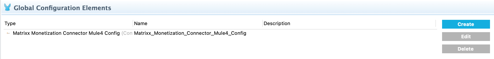

= MATRIXX Monetization Connector

MuleSoft Certified

== About MATRIXX Software

MATRIXX is the world’s go-to monetization solution for telcos who are transforming their business to accelerate innovation as they roll out new network capabilities (5G Standalone and MEC) to effectively compete against existing and emerging competition by providing differentiated real-time customer experiences.  MATRIXX Digital Commerce Platform is purpose-built to deliver web scale performance and agility to diversify revenue streams, better segment customer offers, and innovate more rapidly.  MATRIXX DCP monetizes telco offers across lines of business including consumer, enterprise and wholesale, and facilitates the convergence of existing distinct OSS/BSS silos into a unified monetization process.

== About MATRIXX Monetization Connector
Automated and integrated end-to-end processes are fundamental to enabling telcos to compete at web scale. And at the heart of those integrated processes is MATRIXX Digital Commerce Platform, a monetization engine that delivers commercial agility, maximizes customer agility and ensures operational agility. 

With the MATRIXX Monetization Connector, a telco can readily integrate and orchestrate DCP’s monetization capabilities in real time to all their BSS/OSS systems to they can:

* Rapidly configure new price plans and offers and automatically integrate the DCP pricing catalog with the enterprise commercial catalog

* Support the Configure Price Quote (CPQ) processes through all customer-facing channels by presenting real-time, accurate prices from DCP

* Ensure that all new orders, moves, additions, changes, or deactivations are immediately reflected on the customer’s subscriptions so that one-time charges, recurring charges and usage charges are accurate at all times

== Prerequisites
This document assumes that you are familiar with Mule, Anypoint Connectors and 
Anypoint Studio.

== Prerequisites

* Access to a MATRIXX server

== Mule Compatibility

[width="100%", options="header"]
|=======
|Application/Service |Version
|Mule Runtime |4.0.x and later
|Anypoint Studio | 7.4.x and later
|MATRIXX Software | 5227 and later
|=======

== To Install this Connector in Anypoint Studio
To install the connector open the pom.xml file in the project root folder and add the following dependency:

```
<dependency>
    <groupId>com.mulesoft.connectors</groupId>
    <artifactId>mule4-matrixx-monetization-connector</artifactId>
    <version>1.0.0</version>
    <classifier>mule-plugin</classifier>
</dependency>
```

== Configure in Studio

=== To Configure the Connector
* After adding connector dependency to Mule project, click on *Global Elements* tab at the base of the canvas.
* In the Global Mule Configuration Elements screen, click *Create*.
* In the Choose Global Type wizard, collapse connector configuration and select *'Matrixx Monetization Connector Mule4 Config'* and click OK.



* The configuration parameters to configure is

+
[options="header",width="50%"]
|============
|Field Name         |Value
|Base Uri           |Enter a MATRIXX server.
|Username   | Basic Authentication username.
|Password   | Basic Authentication password.

|============
+

* Parameter values can be directly entered into the global configuration properties.

* Once entered, configuration is ready to use!

== See Also

link:release-notes.adoc[]

